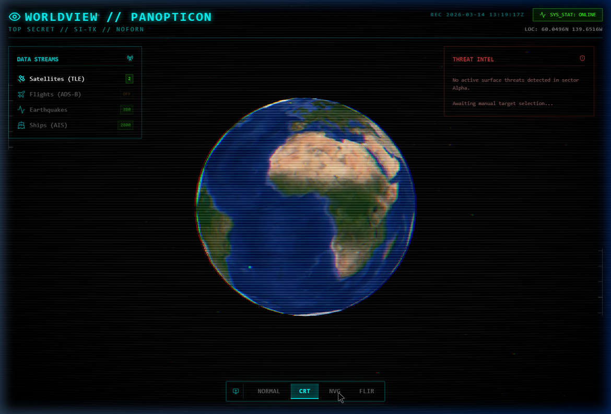
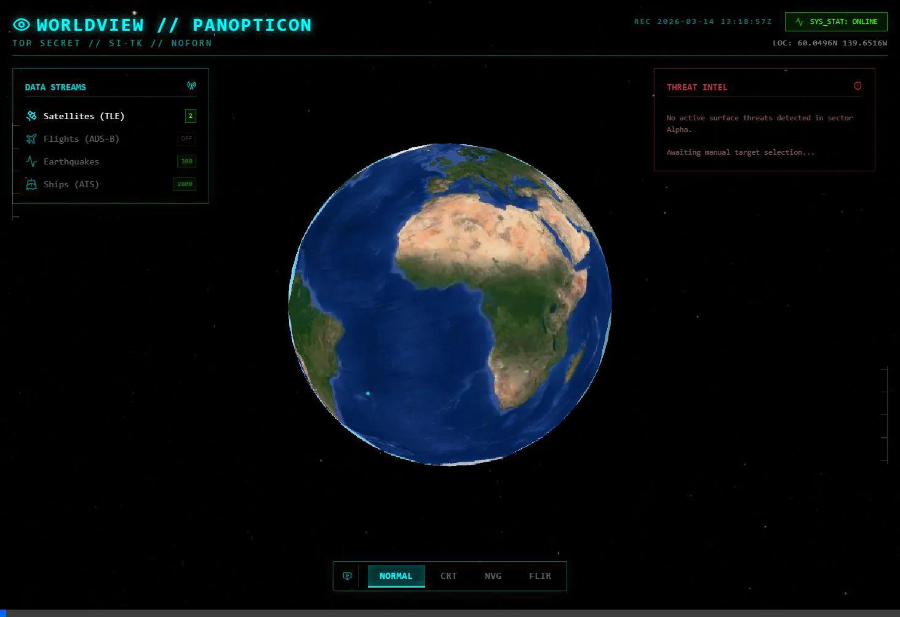

# WORLDVIEW // PANOPTICON 👁️

[](https://reactjs.org/)
[](https://cesium.com/)
[](https://tailwindcss.com/)
[](https://vitejs.dev/)

**Panopticon** is a high-fidelity, tactical OSINT (Open Source Intelligence) 3D dashboard. Built with React and CesiumJS, it aggregates real-time planetary data and renders it onto a photorealistic 3D globe with cinematic, military-grade visual effects.

<p align="center">
  
</p>

## ✨ Features

- 🌍 **Photorealistic 3D Terrain**: Powered by Google Photorealistic 3D Tiles via CesiumJS, offering unparalleled visual fidelity of major cities and topographies.
- 📡 **Live Data Streams**:
  - **Satellites (TLE)**: Real-time orbital tracking of active satellites.
  - **Flights (ADS-B)**: Live commercial aviation tracking.
  - **Military & VIP Aircraft**: Heuristic detection and specialized "Tactical Red/Yellow" rendering for military and non-standard flights.
  - **Earthquakes (USGS)**: Live tectonic activity mapped globally.
  - **Ships (AIS)**: Live maritime traffic monitoring.
- 🚗 **Procedural Traffic**: Algorithmic particle-system traffic simulation over major global tech hubs (NYC, SF, London) to create a lively environment without the performance hit of heavy OSM vector loads.
- 🎯 **Target Lock Intel Panel**: Interactive tracking. Clicking on any entity (flight, satellite, ship) snaps the camera to the target and populates a dynamic threat-intel sidebar with detailed telemetry.
- 🎥 **Cinematic WebGL Shaders**:
  - `NORMAL`: High-resolution satellite view with HDR Bloom effects.
  - `CRT`: 1980s command-center aesthetic with barrel distortion, scanlines, and RGB chromatic aberration.
  - `NVG`: P43 Phosphor Green military night-vision mapping with ISO noise.
  - `FLIR`: High-contrast White-Hot thermal imaging aesthetic.
- 🔗 **Intelligence Correlation**: Automatically draws visual links between selected targets and nearby entities (within 1000km).
- 🕒 **Simulation Scrubbing**: Predict future satellite and flight positions with the integrated timeline control (up to 24h prediction).
- ⚡ **Performance Optimized**: 
  - SGP4 orbital calculations offloaded to Web Workers.
  - Dynamic Flight Clustering (LOD) for 60fps performance at global zoom levels.

## 🚀 Getting Started

### Prerequisites
- [Node.js](https://nodejs.org/) (v16+ recommended)
- [npm](https://www.npmjs.com/) or [yarn](https://yarnpkg.com/)

### Installation

1. Clone the repository:
   ```bash
   git clone https://github.com/Aaryankansari/osint-dashboard.git
   cd osint-dashboard
   ```

2. Install dependencies:
   ```bash
   npm install
   ```

3. Start the development server:
   ```bash
   npm run dev
   ```

4. Open your browser and navigate to:
   - **Development**: `http://localhost:5173`
   - **Production Preview**: `http://localhost:4173` (after running `npm run build`)

## 🛠️ Architecture
- **Frontend Framework**: React 18 + TypeScript
- **State Management**: Zustand
- **3D Engine**: CesiumJS (`cesium`, `resium`)
- **Styling**: Tailwind CSS
- **Icons**: Lucide React
- **Build Tool**: Vite

<p align="center">
  
  <br/>
  <i>Demonstrating the Threat Intel Panel and Cinematic Shaders</i>
</p>

## 📜 License
This project is open-source and available under the [MIT License](LICENSE).

---
*Designed for OSINT analysts, data visualization enthusiasts, and vibe coders.*
